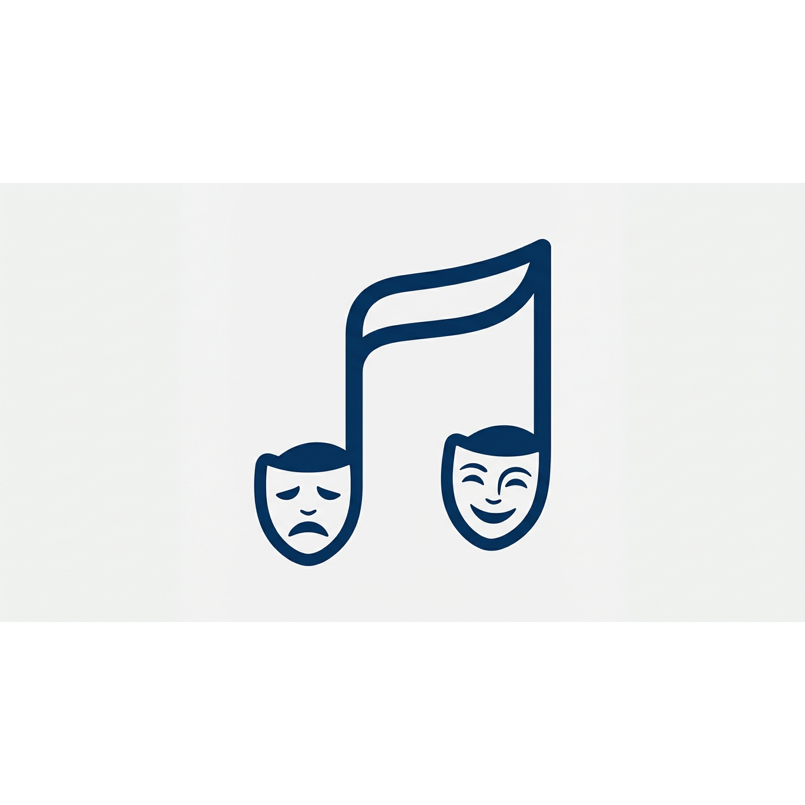

<p align="center">
  
</p>

<h1 align="center">Scherzo</h1>

<p align="center">
  <strong>A music and audio studio.</strong>
</p>

<p align="center">
  <a href="https://github.com/npc-worldwide/scherzo/blob/main/LICENSE"></a>
  <a href="https://github.com/npc-worldwide/scherzo/releases"></a>
</p>

<p align="center">
  <a href="https://github.com/npc-worldwide/scherzo/releases"><strong>Download for Linux, macOS, and Windows</strong></a>
</p>

---

Scherzo is a desktop-first music and audio studio that brings listening, recording, mixing, notation, and AI-assisted generation into one workspace. Keep your audio library and projects local; plug in cloud audio providers when you need them.

Built on Electron + React with a Python backend powered by [npcpy](https://github.com/npc-worldwide/npcpy).

### Highlights

- **Listen** — Browse and play your audio library with a repertoire of titles, composers, and albums.
- **Record** — A multi-track audio editor with recording, clips, per-track volume and pan, mute/solo, and mixdown to WAV.
- **Mix** — A DJ mixer panel for live mixing across decks.
- **Write** — Music notation with score tracks, clefs, and note editing.
- **AI generation** — Generate audio and speech from text prompts using local models or cloud providers (OpenAI, ElevenLabs, and more).
- **Analysis** — Inspect audio with analysis panels for waveform and spectral work.
- **Local-first** — Your library, repertoire, and projects stay on disk.

---

## Setup

### 1. Install

Download the installer for your platform from the [releases page](https://github.com/npc-worldwide/scherzo/releases), run it, and launch Scherzo. Linux (`.deb`/`.AppImage`), macOS (`.dmg`), and Windows (`.exe`) builds are provided.

### 2. First launch

Scherzo opens to the **Listen** library. Use the sidebar to switch between Listen, Record, Mix, and Write.

### 3. Connect a model provider

Open **Settings** and add API keys for any cloud audio or speech providers you want to use. Keys are stored locally. For local generation, configure a Python environment and select it in settings.

---

## Development setup

Scherzo is an Electron + React + TypeScript frontend with a Python Flask backend (`scherzo_serve.py`) powered by [npcpy](https://github.com/npc-worldwide/npcpy).

### Prerequisites

- Node.js 22+ and npm
- Python 3.10+ with [npcpy](https://github.com/npc-worldwide/npcpy) installed

### Install

```bash
git clone https://github.com/npc-worldwide/scherzo.git
cd scherzo
npm install --legacy-peer-deps
```

### Run

```bash
npm run dev
```

The dev frontend runs on port `7339`.

### Build

```bash
npm run build
```

This builds the renderer, Electron main, and preload scripts, then packages the app with electron-builder. To package for a specific platform:

```bash
npx electron-builder --mac
npx electron-builder --win
npx electron-builder --linux
```

---

## Community

- **Issues & Bugs**: [GitHub Issues](https://github.com/npc-worldwide/scherzo/issues)
- **NPC Ecosystem**: [npcpy](https://github.com/npc-worldwide/npcpy) | [npcsh](https://github.com/npc-worldwide/npcsh) | [npcts](https://github.com/npc-worldwide/npcts)

## License

Scherzo is licensed under the MIT License. See the [LICENSE](LICENSE) file for details.
